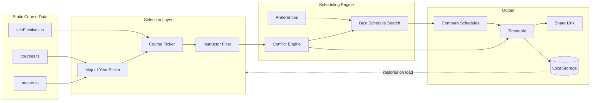

<div align="center">

# 🎓 Zewail City — Fall 2026 Schedule Builder

### A conflict-aware course scheduling engine for Zewail City students

**Pick a major and year, tick your courses, and let a backtracking search engine build your best possible conflict-free timetable — entirely in your browser.**

[](https://fall-2026-zewail-city.vercel.app/)
[](https://github.com/Ahmedamir21/Fall_2026_ZewailCity)


</div>

---

## 📑 Table of Contents

- [Overview](#-overview)
- [Why This Project Exists](#-why-this-project-exists)
- [Key Features](#-key-features)
- [Supported Majors & Years](#-supported-majors--years)
- [Privacy](#-privacy)
- [Architecture](#-architecture)
- [How the Scheduling Engine Works](#-how-the-scheduling-engine-works)
- [Tech Stack](#-tech-stack)
- [Project Structure](#-project-structure)
- [Getting Started](#-getting-started)
- [Development Commands](#-development-commands)
- [Testing](#-testing)
- [Build & Deployment](#-build--deployment)
- [Data Source & Verification Notice](#-data-source--verification-notice)
- [Known Limitations](#-known-limitations)
- [Roadmap](#-roadmap)
- [Contributors](#-contributors)
- [Disclaimer](#-disclaimer)

---

## 🧭 Overview

The **Zewail City Fall 2026 Schedule Builder** is a client-side web application that helps students plan their course registration before it happens. Students choose a major and year, select the courses they intend to register for, and choose a lecture / lab / tutorial combination and instructor for each one. The app checks every selection against every other selection in real time, flags genuine time conflicts, tracks live credit totals and free time, and — on request — runs a search engine that explores every valid instructor/section combination across a student's course list to surface the strongest conflict-free schedules, ranked against the student's own stated preferences.

Everything runs in the browser. There is no backend, no account system, and no server-side storage — the app is a static site.

## 💡 Why This Project Exists

Manually building a conflict-free schedule from a printed or PDF course list is tedious and error-prone: it means cross-checking dozens of lecture/lab/tutorial times by hand, across every instructor section, while also tracking credit limits and personal time preferences. This project automates that process — turning a multi-hour manual exercise into a few clicks, while remaining transparent about *why* a given option is disabled or *why* a schedule was ranked the way it was.

## ✨ Key Features

### Course selection
- **Major & Year Picker** — Choose Information Technology, Data Science & AI, or Software Engineering, then scope the course list to Year 1, 2, 3, or 4.
- **Shared SCH Electives** — University-wide elective courses (e.g. Critical Thinking, Sustainability & Ethical Issues in Computing) are available across every major and year, without being duplicated in each year's plan.
- **Cross-Year Course Browser** — Browse and add courses from other years of the same major (for example, picking up a Year 4 elective while primarily planning Year 3).
- **Course Section Selection** — Tick the exact courses being registered for, with each one showing every real lecture, lab, and tutorial section published for Fall 2026.

### Scheduling logic
- **Lecture / Lab / Tutorial Selection** — Each component of a course is chosen independently, so a lecture and its lab can come from different sections.
- **Cross-Instructor Component Selection** — Lecture and lab/tutorial selections are not locked to a single instructor; the picker and the engine both consider every valid instructor pairing for a course, not just one.
- **Instructor Filtering** — Narrow a course's visible options down to a specific instructor with a reversible filter pill; hidden options are always disclosed with a count and a reason, and un-filtering restores them instantly.
- **Exact Conflict Detection** — Conflicts are computed on real time intervals (`startA < endB && startB < endA`), so back-to-back sessions such as 2:00–2:59 followed by 3:00–3:59 are never falsely flagged as overlapping.
- **✦ Best Schedule Engine** — A most-constrained-first backtracking search across every instructor and section combination for the selected courses, ranked by the student's stated preferences, with a bounded search budget so the UI never hangs.
- **Schedule Preferences** — Preferred days, keep-free days, time windows, no-before/no-after limits, and a max-hours-per-day cap — each can act as a soft ranking signal or be switched to a hard requirement, with the app explicitly stating when a hard requirement can't be satisfied.
- **Credit Limits** — A configurable credit cap (13 / 18 / 21, matching Zewail City's GPA-based registration tiers) that the picker and engine both respect.
- **Compare Schedules** — Line up to three generated schedules side by side before committing to one.

### Interface & data handling
- **Weekly Timetable** — A visual, mobile-friendly grid with conflict highlighting and a pinned time gutter on touch devices.
- **Live Credits Dashboard** — Real-time credit totals and free-time calculation (a true union of time intervals, so overlapping free blocks are never double-counted).
- **Shareable Schedules** — A share link encodes the selected major, courses, sections, instructor filters, and preferences into a compact URL that restores the exact plan on any device or browser — no login, no account, and no personal data in the link.
- **Mobile Responsive Design** — A sticky bottom action bar, touch-sized tap targets, and a swipeable timetable on small screens.
- **Dark / Light Mode** — A full theme system with the chosen theme persisted between visits.
- **LocalStorage Persistence** — Picks, filters, and preferences are saved locally and restored automatically on return visits, with `?schedule=` URL state taking priority when present.
- **Print / Export** — A clean, print-ready schedule view with the planner UI hidden.

## 🎓 Supported Majors & Years

| Major | Track | Year 1 | Year 2 | Year 3 | Year 4 |
|---|---|:---:|:---:|:---:|:---:|
| **Information Technology** | Networks, Security & Governance | ✅ | ✅ | ✅ | ✅ |
| **Data Science & AI** | Data integration, analytics & intelligent systems | ✅ | ✅ | ✅ | ✅ |
| **Software Engineering** | Engineering process & physics track | ✅ | ✅ | ✅ | ✅ |

All three majors share a common Year 1 core (CSAI, MATH) with major-specific tracks branching from Year 1 onward, and all majors can draw on the same pool of shared **SCH elective courses** regardless of year.

## 🔒 Privacy

This application stores **nothing on any server**. It is not connected to, and does not communicate with, Zewail City's Self-Service registration system in any way — it is an independent planning tool.

- Course, section, and instructor selections live only in the browser's `localStorage`.
- Share links encode only opaque course/section identifiers and preference flags — never a name, ID number, email, or any other personal or academic information.
- There are no accounts, no login, no analytics beyond standard hosting-platform infrastructure, and no server-side data store.

## 🏗️ Architecture

The application is a single-page React app. All computation — conflict checking, credit totals, and schedule generation — happens client-side.



## ⚙️ How the Scheduling Engine Works

1. **Candidate building** — For each selected course, every valid lecture + lab/tutorial pairing is built across *all* published instructors (not just one), with hard constraints applied as early exclusions.
2. **Most-constrained-first search** — Courses with fewer valid remaining options are explored first, which maximizes how much of the search tree can be pruned early.
3. **Conflict pruning** — A search branch is discarded the instant any two meetings overlap in time, so no work is wasted exploring an already-invalid combination.
4. **Bounded, honest results** — A safety cap on how many search-tree nodes are explored guarantees the UI never hangs on a large course load, and the app is explicit in its results about whether a ranking is exhaustive, provably optimal, or the best one found within the search budget.
5. **Transparent ranking** — Every schedule's score is a disclosed, weighted combination of the student's own preferences — never an unexplained black box.

## 🛠️ Tech Stack

| Layer | Technology |
|---|---|
| UI framework | React 19 + TypeScript |
| Build tool | Vite 7 (single-file production build via `vite-plugin-singlefile`) |
| Styling | Tailwind CSS 4 |
| Testing | esbuild-powered Node test harness — engine logic, SSR rendering, and real-DOM UI interaction |
| Hosting | Vercel (static build output) |

## 📁 Project Structure

```
├── index.html
├── schedule-planner.html
├── package.json
├── vite.config.ts
├── tsconfig.json
├── src/
│   ├── main.tsx                 # App entry point
│   ├── App.tsx                  # Root application state & layout
│   ├── types.ts                 # Shared TypeScript types
│   ├── index.css                # Global styles & theme variables
│   ├── components/
│   │   ├── MajorPicker.tsx        # Major selection
│   │   ├── YearPicker.tsx         # Year selection
│   │   ├── CoursePicker.tsx       # Course + section selection
│   │   ├── CrossYearBrowser.tsx   # Browse courses from other years
│   │   ├── Controls.tsx           # Top-level action controls
│   │   ├── Timetable.tsx          # Weekly schedule grid
│   │   ├── BestSchedule.tsx       # Best Schedule engine results
│   │   ├── CompareSchedules.tsx   # Side-by-side schedule comparison
│   │   ├── ScheduleDetails.tsx    # Selected schedule breakdown
│   │   ├── SchedulePreferences.tsx# Soft/hard preference controls
│   │   ├── ShareSchedule.tsx      # Share-link generation
│   │   ├── CreditsDashboard.tsx   # Live credit & free-time tiles
│   │   ├── CreditLimitNote.tsx    # GPA-tier credit cap selector
│   │   ├── StatsBar.tsx           # Summary statistics strip
│   │   ├── EngineAudit.tsx        # In-app engine self-check panel
│   │   ├── ThemeToggle.tsx        # Dark / light mode switch
│   │   ├── EmptyState.tsx         # Empty-state placeholders
│   │   └── AboutPage.tsx          # In-app help / about screen
│   ├── data/
│   │   ├── courses.ts             # Course, section & instructor data (Fall 2026)
│   │   ├── majors.ts              # Major → Year → Course mappings
│   │   └── schElectives.ts        # Shared SCH elective course data
│   ├── lib/
│   │   ├── scheduler.ts           # Combination generation & metrics
│   │   ├── bestSchedule.ts        # Best-Schedule ranking engine
│   │   ├── picks.ts               # Option-state derivation (hidden/conflict logic)
│   │   ├── preferences.ts         # Preference model & sanitization
│   │   ├── share.ts               # Share-link encode/decode
│   │   ├── appState.ts            # LocalStorage persistence
│   │   ├── freeTime.ts            # Free-time / occupied-time computation
│   │   ├── time.ts                # Time-interval helpers
│   │   └── stateValidation.ts     # Restored-state validation
│   └── utils/
│       └── cn.ts                  # Class-name merge helper
└── tests/
    ├── harness.ts                 # Core engine assertions (Node)
    ├── ssr.tsx                    # Full-app SSR smoke test
    ├── mkurl.ts                   # Share-URL construction helper
    ├── ui-maxhours.tsx            # Real-DOM: max-hours preference
    ├── ui-share.tsx               # Real-DOM: share sheet
    └── ui-yearcap.tsx             # Real-DOM: year picker & credit cap
```

## 🚀 Getting Started

### Prerequisites
- Node.js `^20.19.0` or `>=22.12.0`

### Installation

```bash
git clone https://github.com/Ahmedamir21/Fall_2026_ZewailCity.git
cd Fall_2026_ZewailCity
npm install
```

> The application source lives inside the repository's nested project folder shipped by this branch. If `npm install` fails at the repository root, `cd` into the folder containing `package.json` (the one with `src/`, `vite.config.ts`, and `tests/`) before running the commands below.

## 🧑‍💻 Development Commands

```bash
npm run dev       # Start the Vite dev server at http://localhost:5173
npm run build     # Production build → single self-contained dist/index.html
npm run preview   # Serve the production build locally
```

## 🧪 Testing

The project ships with a multi-layer test suite, run with esbuild + Node (no external test runner required):

```bash
npm run test:harness   # Core scheduling engine, share codec, state persistence, preferences
npm run test:ssr       # Full-app server-side rendering smoke test
npm run test:ui        # Real-DOM UI interaction tests (max-hours, share sheet, year picker & credit cap)
```

Conflict detection, credit-cap enforcement, share-link encoding/decoding, and preference sanitization are all covered by dedicated assertions, including hostile/corrupt input handling for restored state.

## 📦 Build & Deployment

```bash
npm run build
```

This produces a single self-contained `dist/index.html` (via `vite-plugin-singlefile`), with all JavaScript and CSS inlined — no separate asset files to host.

The live instance is deployed on **Vercel**, using `npm run build` as the build command and `dist` as the output directory:

**🔗 [fall-2026-zewail-city.vercel.app](https://fall-2026-zewail-city.vercel.app/)**

## 📊 Data Source & Verification Notice

Course, section, instructor, and timing data is **manually compiled and verified against Zewail City's Self-Service registration system** for the Fall 2026 Main Session. This project is **not connected to Self-Service** in any technical or automated way — there is no live sync, API integration, or scraping. Course offerings, instructors, and section times are subject to change by the university at any point, so:

> ⚠️ **Always verify your final schedule against the official Self-Service portal before registering.**

## ⚠️ Known Limitations

- Data reflects a manually verified snapshot of the Fall 2026 Main Session and will not automatically pick up later changes made by the university.
- The Best Schedule engine operates within a bounded search budget for performance reasons; for course loads with an extremely large number of valid combinations, results may be labeled as "best found so far" rather than exhaustively optimal.
- The app currently covers Information Technology, Data Science & AI, and Software Engineering only.

## 🗺️ Roadmap

- [ ] Expand data coverage to additional majors and schools
- [ ] Add automated data-refresh tooling to speed up verification against future terms
- [ ] Explore optional calendar export (e.g. `.ics`)

## 👥 Contributors

- **Ahmed Amir Ibrahim**
- **Youssef Taha Ahmed**

## 📄 Disclaimer

This is an independent, student-built planning tool provided for educational use by Zewail City students. It is **not an official Zewail City product** and is **not connected to the Self-Service registration system**. All course, section, and instructor data should be independently verified against the official registration portal before finalizing any course registration.

---

<div align="center">

**Zewail City Schedule Builder** · Fall 2026 · Main Session

</div>
